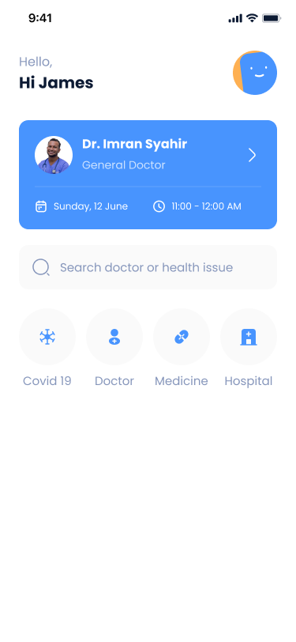
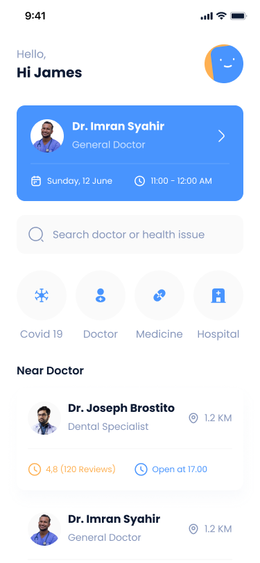
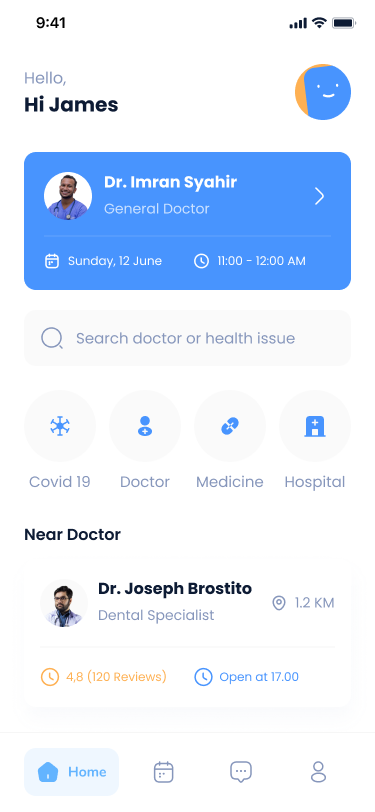

# iO~~C~~S. Лабораторная работа №1: реализация экрана при помощи SwiftUI

### ЦК ОмГТУ 2024

**Mac OS 12.7.1**

**XCode 14.1**

В ходе работы и виртуалка, и гит очень пытались заработать, но не смогли... поэтому пришлось страдать, а также отдельно коммитить со своего ПК.

### Задание

Необходимо реализовать представленный ниже экран используя SwiftUI.

 

 

 

 

### Результат работы

В результате работы был реализован экран, включающий в себя приветственный заголовок, информацию о ближайшем враче, поле для поиска, категориальное меню, блок с ближайшими врачами и нижнюю навигационную панель.
